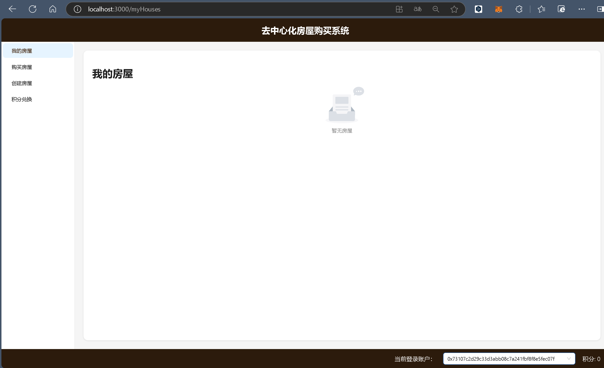
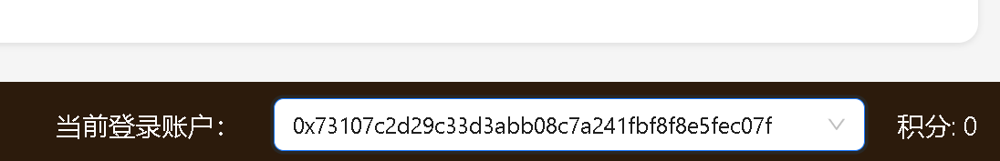
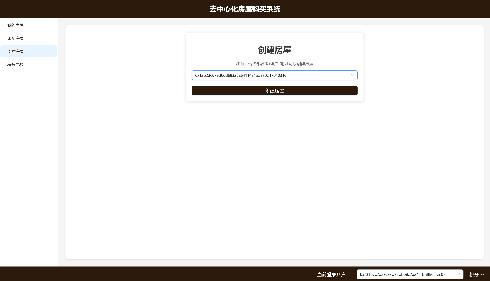
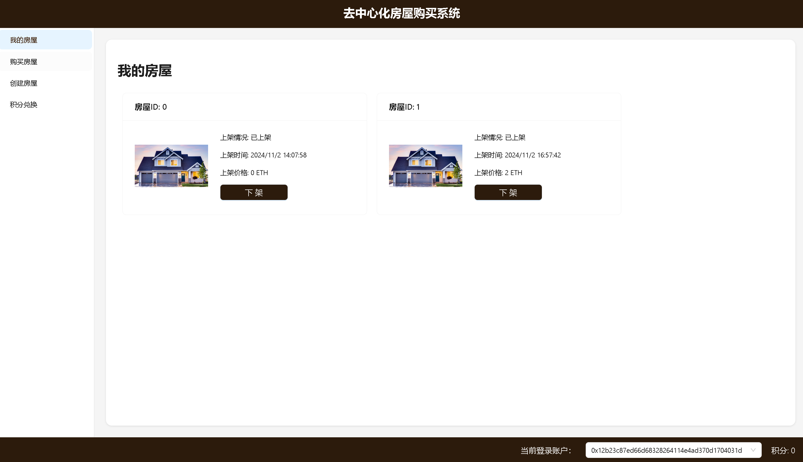
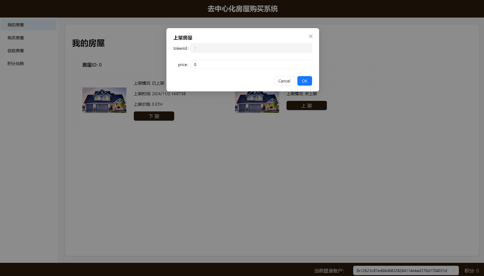
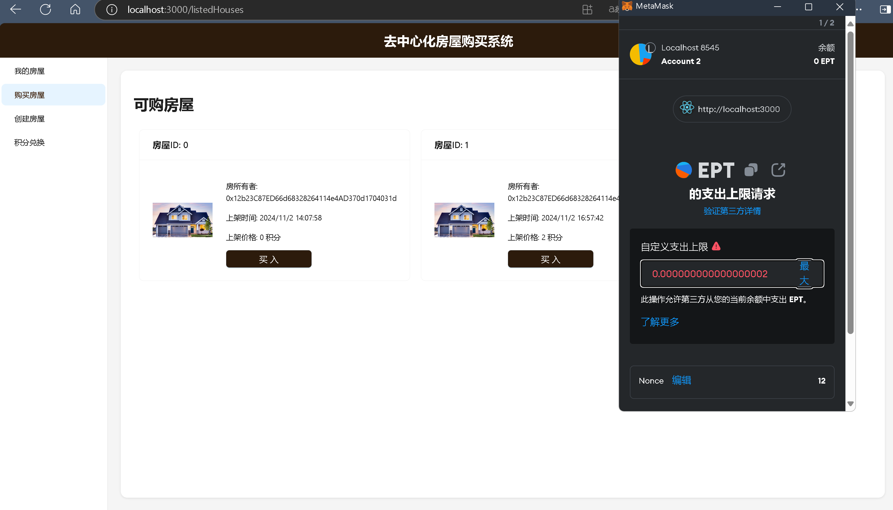
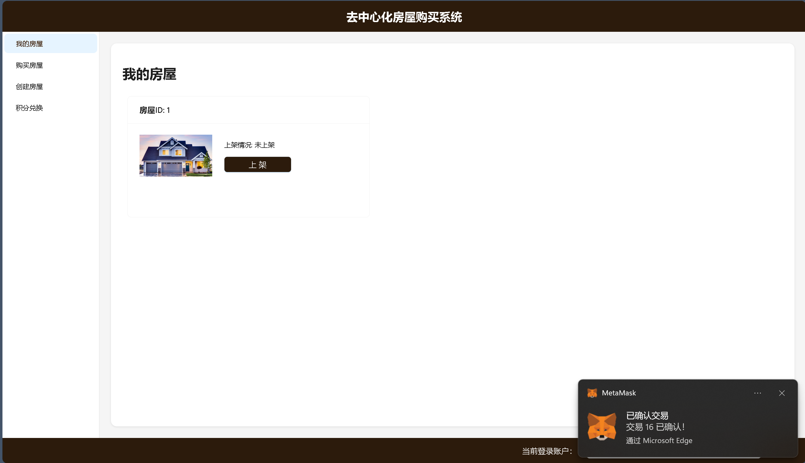
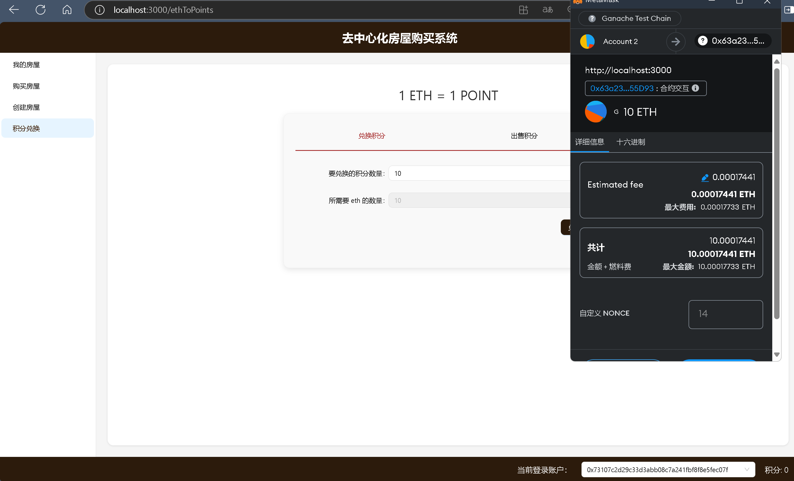

# WC-ZJU-blockchain-course-2024

## 项目介绍
本项目是一个简易的房屋出售系统，在网站中：


在网站中，用户可以出售，或者使用测试以太币购买房屋，每个用户可以：
- 1、查看自己拥有的房产列表。并可以挂单出售自己的房屋（挂单包含价格等信息）。
- 2、用户查看所有出售中的房产，并查询一栋房产的主人，及各种挂单信息。
- 3、用户选择支付房屋价格对应的测试以太币，购买某个其他用户出售的房产。购买后房产拥有权应当发生变化。
- 4、用户可以将测试以太币兑换成ERC20积分，并使用ERC20积分完成购买房屋的流程。


## 如何运行

补充如何完整运行你的应用。

1. 在本地启动ganache应用。

2. 在 `./contracts` 中安装需要的依赖，运行如下的命令：
    ```bash
    npm install
3. 在 `./contracts/hardhat.config.ts` 中，将 accounts 修改为对应ganache账户私钥  
    
4. 在 `./contracts` 中编译合约，运行如下命令：
    ```shell
    npx hardhat compile      
5. 在 `./contracts` 中将合约部署到 ganache，运行如下命令：

    ```shell
   npx hardhat run ./scripts/deploy.ts --network ganache
    这样之后将会得到两个地址，一个是 `BuyMyRoom` 合约部署地址、一个是其中的 `ERCPoint` 合约部署地址。
6. 将 `./frontend/src/utils` 的 `contract-addresses.json` 的两个值分别改为上述步骤的两个地址（注意前后不要多加空格）；

7. 将 `./frontend/src/utils/abis` 的两个json文件替换为 `.contracts/artifacts/contracts` 下的 `BuyMyRoom.json` 和 `ERCPoint.json`

8. 在 `./frontend` 中安装需要的依赖，运行如下的命令：
    ```bash
    npm install
9. 在 `./frontend` 中启动前端程序，运行如下的命令：
    ```bash
    npm run start
    ```

 
## 功能实现分析

实现了两个BuyMyRoom（ERC721）合约和 ERCPoint（ERC20）合约。

- BuyMyRoom合约中记录了房子的状态信息，包括每个房子的所有者，是否上架，上架的价格和时间，房屋ID。该合约还实现了创建房屋、查看房屋、、使用 ETH 或者 ERC20 积分买卖房屋的相关操作。

  ```c++
  contract BuyMyRoom is ERC721 {
      // 上架、下架、出售（购买）房屋事件
      event HouseList(uint256 tokenId, uint256 price, address owner);
      event HouseDelist(uint256 tokenId, address owner);
      event HouseSell(uint256 tokenId, uint256 price, address seller, address buyer);
      
      // 房屋结构体
      struct House {
          uint256 tokenId;
          address owner;
          bool isListed;
          uint256 listedTimestamp;
          uint256 price;
      }
      
      address private deployer;           // 合约部署者
      uint256 private allocatedId = 0；   // 分配给房子的Id，自增
      mapping(uint256 => House) public houses; // token -> House 映射表

      uint256 private feeRate = 1; // 手续费比例 1‰
      ERCPoint public ercPoint;    // 积分合约

      constructor() ERC721("BuyMyRoom", "BYMR") {
          deployer = msg.sender; // 合约部署者初始化
          ercPoint = new ERCPoint();
      }
      ......
  }
  ```


- ERCPoint合约实现了允许用户将测试以太币兑换成ERC20积分，并使用ERC20积分完成购买房屋的流程。

  ```c++
  contract ERCPoint is ERC20 {

    event ex_EthToPoints(address buyer, uint256 eth);
    event ex_PointsToEth(address buyer, uint256 points);
    
    address private deployer;

    constructor() ERC20("ERCPoint", "EPT") {
        deployer = msg.sender;
    }

    function getMyPoints() public view returns (uint256) {
        return balanceOf(msg.sender);
    }

    function PointsToEth(uint256 points) public {
        // 1 points => 1 eth
        _burn(msg.sender, points);
        payable(msg.sender).transfer(points * 1 ether);
        emit ex_PointsToEth(msg.sender, points);
    }
    
    function EthToPoints() public payable {
        // 1 eth => 1 points
        uint256 points = msg.value / 1 ether;
        _mint(msg.sender, points);
        emit ex_EthToPoints(msg.sender, points);
    }
  }
  ```

#### 1. 为用户创建房屋

```c++
function create_house(address owner) public returns(uint256) {
        require(deployer == msg.sender, "Invalid deployer");       
        // 分配新的 ID
        uint256 newId = allocatedId ++;
        _safeMint(owner, newId);
         // 创建房屋并存储信息
        houses[newId] = House({
            tokenId: newId,
            listedTimestamp: 0,
            price: 0 ,
            owner: owner,
            isListed: false           
        });
        return newId;
    }
```

#### 2. 查看个人房屋列表

```c++
function get_myHouses() public view returns(House[] memory) {
        uint count = 0;   
        // 计算用户拥有的房屋数量
        for (uint i = 0; i < allocatedId; i++) {
            if (houses[i].owner == msg.sender) {
                count++;
            }
        }    
        // 创建房屋数组
        House[] memory myhouses = new House[](count);
        uint counter = 0; 
        // 收集用户拥有的房屋信息
        for (uint i = 0; i < allocatedId; i++) {
            if (houses[i].owner == msg.sender) {
                myhouses[counter++] = houses[i]; 
            }
        }
        return myhouses;
    }
```


```c++
    // 获取已上架房屋列表
    function get_Houses_onList() public view returns(House[] memory) {
        uint count = 0;   
        // 计算已上架房屋的数量
        for (uint i = 0; i < allocatedId; i++) {
            if (houses[i].isListed) {
                count++;
            }
        }   
        // 创建已上架房屋数组
        House[] memory houses_onlist = new House[](count);
        uint counter = 0;  
        // 收集已上架房屋信息
        for (uint i = 0; i < allocatedId; i++) {
            if (houses[i].isListed) {
                houses_onlist[counter++] = houses[i]; // 直接引用
            }
        }
        return houses_onlist;
    }
```

#### 3. 用户上下架房屋


```c++
// 上架房屋
    function list_House(uint256 tokenId, uint256 price) public {
        require(houses[tokenId].owner == msg.sender, "You are not the owner of this house");
        houses[tokenId].price = price;
        houses[tokenId].isListed = true;
        houses[tokenId].listedTimestamp = block.timestamp;
        emit HouseList(tokenId, price, msg.sender);
    }

    // 下架房屋
    function delist_House(uint256 tokenId) public {
        require(houses[tokenId].owner == msg.sender, "You are not the owner of this house");
        houses[tokenId].price = 0;
        houses[tokenId].isListed = false;
        houses[tokenId].listedTimestamp = 0;
        emit HouseDelist(tokenId, msg.sender);
    }
```

#### 4. 用户使用ETH购买房屋

```c++
function buy_House(uint256 tokenId) public payable{
    // 获取房屋价格和卖家地址
    uint256 price = houses[tokenId].price;
    address seller = houses[tokenId].owner;
    // 确保发送的以太币金额正确
    require(msg.value >= price * 1 ether, "Insufficient funds sent");
    // 计算手续费
    uint256 fee = (block.timestamp - houses[tokenId].listedTimestamp) * feeRate * price / 1000;
    // 确保手续费不超过价格
    if (fee > price) fee = price;
    uint256 amount = price - fee;
    // 转移房屋所有权
    _transfer(seller, msg.sender, tokenId);
    // 支付给卖家和开发者
    payable(seller).transfer(amount * 1 ether);
    payable(deployer).transfer(fee * 1 ether);
    // 更新房屋信息
    houses[tokenId].owner = msg.sender;
    houses[tokenId].isListed = false;
    houses[tokenId].listedTimestamp = 0;
    houses[tokenId].price = 0;
    // 发出销售事件
    emit HouseSell(tokenId, price, seller, msg.sender);
    }
```
#### 5. 使用ERC20积分购买房屋

```c++
    function buy_HouseWithPoint(uint256 tokenId) public {
        uint256 price = houses[tokenId].price;
        address seller = houses[tokenId].owner;
        uint256 fee = (block.timestamp - houses[tokenId].listedTimestamp) * feeRate * price / 1000;
        if (fee > price) fee = price;
        uint256 amount = price - fee;
        // 所有权转移
        _transfer(seller, msg.sender, tokenId);
        // 支付
        ercPoint.transferFrom(msg.sender, seller, amount);
        ercPoint.transferFrom(msg.sender, deployer, fee);

        houses[tokenId].owner = msg.sender;
        houses[tokenId].isListed = false;
        houses[tokenId].listedTimestamp = 0;
        houses[tokenId].price = 0;
        emit HouseSell(tokenId, price, seller, msg.sender);
    }
```
#### 6. ERC20积分与ETH相互兑换

```c++
 function PointsToEth(uint256 points) public {
        // 1 points => 1 eth
        _burn(msg.sender, points);
        payable(msg.sender).transfer(points * 1 ether);
        emit ex_PointsToEth(msg.sender, points);
    }
    
    function EthToPoints() public payable {
        // 1 eth => 1 points
        uint256 points = msg.value / 1 ether;
        _mint(msg.sender, points);
        emit ex_EthToPoints(msg.sender, points);
    }
```


## 项目运行截图

按照步骤运行后，自动打开浏览器（已下载MetaMask），访问 localhost:3000：


#### 1. 合约部署者为用户创建房屋 

账户[0]是合约部署者，

可以使用该账户来创建房屋，挑选一个账户，例如下图对账户 0x12b23C87ED66d68328264114e4AD370d1704031d 创建房子，点击创建房屋后，会弹出 MetaMask框，都点击确定即可，最后能看到创建成功信息提示：


#### 2.查看所有房屋

#### 3.上、下架现有房屋
点击上架房屋之后，metamask弹出框，点击确定，即可看到上架成功信息提示：

#### 4.购买房屋
点击购买，选择要购买的房屋，点击购买，metamask弹出框，会让你设置每次交易的限额，之后点击确定，即可看到购买成功信息提示：

购买成功后，可在自己的房屋列表中看到新购买的房屋：

#### 5.兑换积分
点击兑换积分，选择兑换积分，点击兑换，metamask弹出框，会让你设置每次交易的限额，之后点击确定，即可看到兑换积分成功信息提示

## 参考内容

- 课程的参考Demo见：[DEMOs](https://github.com/LBruyne/blockchain-course-demos)。

- 快速实现 ERC721 和 ERC20：[模版](https://wizard.openzeppelin.com/#erc20)。记得安装相关依赖 ``"@openzeppelin/contracts": "^5.0.0"``。

- 如何实现ETH和ERC20的兑换？ [参考讲解](https://www.wtf.academy/en/docs/solidity-103/DEX/)

如果有其它参考的内容，也请在这里陈列。
